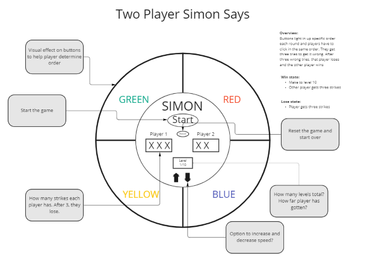
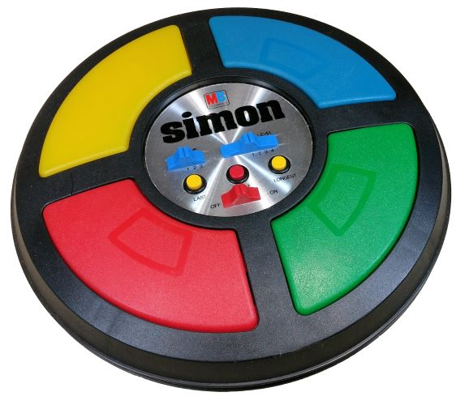

# Simon Game
###### Project Status WIP
Mod 1 project for Per Scholas codebridge.



## Motivation

The purpose of this project is to create a game using HTML, CSS, and JavaScript, along with all the knowledge and skills gained during class.

## Description

Simon is a short-term memory game originally invented by Ralph H. Baer and Howard j. Morrison in 1978. A series of tones and lights are played in a sequence and the player has to repeat in the exact order, or else they fail the game.

## Why Simon?

I chose Simon because I really enjoyed this game as a kid and I wanted to challenge myself. I also honestly thought it would be easy it make it two-player since I had a template for the code. However, I now realize that it's not that simple.

This project was inspired by the Simon JavaScript Game tutorial from [freeCodeCamp](https://www.freecodecamp.org/news/simon-javascript-game-tutorial/) and the Simon Game tutorial from [Freshman Tech](https://freshman.tech/simon-game/).

## Lessons

#### Logic
From working on this project I learned the importance of getting your logic down first. Coding logic is something that I struggle with and this project has helped me to gain a better understanding of how to think through the steps. Simon is simple at its core, the computer gives sequence, and you either get it or not. But I had to really sit down and think about how to translate this to be able to code it.

```JS
//set to computer turn
    //increase level
    //computer gives sequence
//set to p1 turn
    //p1 inputs sequence
        //if p1 fails
            //end game
        //if p1 succeeds
//set to p2 turn
    //p2 inputs sequence
        //if p2 fails
            //end game
        //if p2 succeed
            //repeat
```
#### Simplicity

Less is more, in most cases. I learned to focus on the core pieces and go from there. Every single thing doesn't always need a variable. And when starting out as a beginner, keeping it simple will save you a headache

### Unresolved Problems
I had originally intended to make this a two-player game by way of having the "Simon" generate two different patterns for two different players and having the turns alternate. I ran into a lot of difficulty with that scenario and had to keep simplifying the game. The final product differs from the original wireframe but still keeps some aspects.

### Future Goals
* both single-player and two-player modes
* different patterns for each player
* multiple strikes
* CMYK mode
* increase/decrease speed
* difficulty - one long pattern to remember
* accessibility - colorblindness

**Follow this [link](https://adamskristy.github.io/simon-says/) to check out my project. Thanks for checking it out**